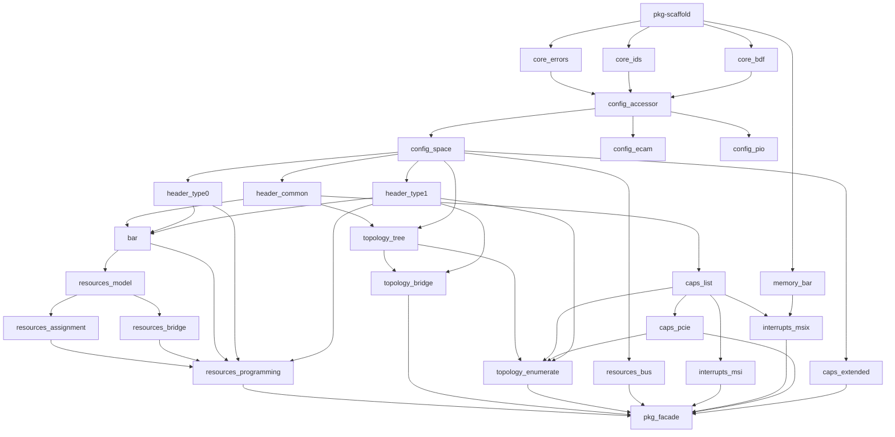

# Implementation DAG

Planning material. Not normative. Derived from approved specs under `docs/specs/`;
where this document disagrees with a spec, the spec wins.

Purpose: turn the approved spec set into a parallel implementation plan for
subagents. Each node lists one owning spec, its target files, its dependency
edges, and its exit criteria.

## Conventions

- **Node** = one implementation module = one approved spec.
- **Edge** = a `@import` (or accessor consumption) dependency taken directly from
  `docs/specs/architecture.md` §Dependency direction and each spec's `## Layering`.
- **Wave N** = all nodes whose prerequisites landed by wave `N-1`. Nodes in the
  same wave never edit the same file and may execute in parallel.
- **Facade nodes** are wave-boundary integration steps. Domain namespace facades
  (`src/<domain>.zig`) are re-exported after every unit inside that domain has
  landed in the current wave; the package facade `src/zpci.zig` is finalized in
  the last wave.
- **Tests co-land with source.** Every unit must ship the tests its owning spec
  and `docs/guidelines/testing.md` require (unit / layout / malformed / sizing /
  programming / traversal, as applicable). Test authoring may be delegated to
  the `Tester` subagent inside the same wave; the implementer subagent MUST NOT
  yield until `zig build test` passes on the touched module.
- **Verification** at every wave boundary: `zig build test`. No project-wide
  smoke tests run inside a per-unit subagent.

## Graph



## Wave 0 — Package scaffolding

Single node. Everything else waits on it.

### `pkg-scaffold`
- Spec: `docs/specs/index.md` §Build product, `docs/guidelines/testing.md`.
- Target files:
  - `build.zig` — exposes the `zpci` module with `zstdx` dependency and a
    default `test` step over the host suite.
  - `build.zig.zon` — declares dependencies (`std`, `zstdx`), package name `zpci`.
  - `src/zpci.zig` — empty facade skeleton (no re-exports yet).
- Change: minimal buildable package; `zig build test` returns 0 with the empty
  suite. No `src/arch/` directory.
- Acceptance: `zig build` and `zig build test` succeed on the host.

## Wave 1 — Core and memory leaves

All parallel. Import only `std`, `builtin`, and approved `zstdx` namespaces;
no zpci sibling imports.

### `core-errors`
- Spec: `docs/specs/core/errors.md`.
- Target: `src/core/errors.zig`.
- Change: `pub const Error = error{...}` union exactly as spec §Package error set;
  domain-error mapping helpers if the spec names any.
- Acceptance: variant list matches the spec byte-for-byte; unit tests assert
  every variant exists.

### `core-ids`
- Spec: `docs/specs/core/ids.md`.
- Target: `src/core/ids.zig`.
- Change: `SegmentId`, `VendorId`, `DeviceId`, `RevisionId`, `BaseClass`,
  `Subclass`, `ProgIf`, `ClassCode` newtypes with `of` / `from` / `eql` /
  named constants; `comptime` layout assertions for `ClassCode`.
- Acceptance: unit tests cover comptime rejection, runtime `from` `InvalidIdentifier`
  cases, absent-vendor check, `ClassCode` layout assertion.

### `core-bdf`
- Spec: `docs/specs/core/bdf.md`.
- Target: `src/core/bdf.zig`.
- Change: `Bdf` (`packed struct(u16)`), `Sbdf` (`packed struct(u32)`), ECAM
  aperture-relative offset math, `function0Of`, ordering / iteration helpers,
  layout `comptime` blocks.
- Acceptance: layout bit-cast tests (LSB-first invariant), offset math over
  boundary buses, `lessThan` totality, `from` rejects `d > 31` / `f > 7`.

### `memory-bar`
- Spec: `docs/specs/memory/bar.md`.
- Target: `src/memory/bar.zig`.
- Change: `BarMemory` accessor (context + vtable + `len_bytes`), `Error` set,
  `read32` / `write32` with alignment and containment validation, a byte-backed
  `FakeBarMemory` helper for host tests.
- Acceptance: OOB, unaligned, and successful round-trip tests against a
  `[]u8` fake; alignment enforcement at 4-byte natural width.

### Facade integration (this wave)
- `src/core.zig` — re-exports `SegmentId`, `VendorId`, …, `Bdf`, `Sbdf`, `Error`.
- `src/memory.zig` — re-exports `BarMemory`.

## Wave 2 — Config accessor

### `config-accessor`
- Spec: `docs/specs/config/accessor.md`.
- Target: `src/config/accessor.zig`.
- Change: `ConfigSpace` (context + vtable), `ConfigSpace.Error`, width-specific
  reads / writes with 4 KiB function-window containment and natural-width
  alignment; `FakeConfig` byte-backed host fake with single-function and
  multi-function-dispatch constructors as required by the spec.
- Acceptance: containment, alignment, and multi-function-dispatch fake tests;
  every `Error` variant produced.

## Wave 3 — Config backends and function view

Parallel; all depend only on `config-accessor` + core.

### `config-space`
- Spec: `docs/specs/config/space.md`.
- Target: `src/config/space.zig`.
- Change: `function_window_size`, `HeaderKind` enum, `Function` view
  (`ConfigSpace` + `Sbdf`), presence probe (`AbsentFunction`), header-kind
  dispatch (`BadHeaderType`), common-identifier reads, width-specific convenience
  wrappers.
- Acceptance: presence, bad-header-type, common-id reads, and every width
  wrapper covered against `FakeConfig`.

### `config-ecam`
- Spec: `docs/specs/config/ecam.md`.
- Target: `src/config/ecam.zig`.
- Change: `Segment` descriptor (`validate` / `contains` / `whole`), `Ecam`
  implementing `ConfigSpace` over `[]const Segment` with `find` dispatch and
  volatile MMIO reads/writes.
- Acceptance: bus-range containment, duplicate-segment rejection, `find`
  hit/miss, ECAM offset math over multi-segment aperture set (via a fake
  MMIO buffer).

### `config-pio`
- Spec: `docs/specs/config/pio.md`.
- Target: `src/config/pio.zig`.
- Change: `Pio` backend using `stdx.arch.x86_64.Port` for CF8/CFC sequencing;
  conventional 256-byte window containment; segment-zero policy.
- Acceptance: PIO tests gated by `builtin.target.cpu.arch == .x86_64`; the
  compilable non-target case exercises containment/segment validation without
  emitting `outb`/`inb`.

### Facade integration
- `src/config.zig` — re-exports `ConfigSpace`, `Function`, `Ecam`, `Segment`,
  `Pio`, `HeaderKind`, and `FakeConfig` under the domain facade.

## Wave 4 — Headers

Parallel; three sibling nodes, no cross-imports between `type0` and `type1`.

### `header-common`
- Spec: `docs/specs/header/common.md`.
- Target: `src/header/common.zig`.
- Change: `CommonHeader` `extern struct` with layout `comptime` block;
  `Command` and `Status` `packed struct(u16)` decodes; `header.common.View`
  over `config.Function` with typed reads and the writes named in the spec.
- Acceptance: layout asserts pass at comptime; command/status round-trip;
  view reads over a hand-built config-buffer fixture.

### `header-type0`
- Spec: `docs/specs/header/type0.md`.
- Target: `src/header/type0.zig`.
- Change: `Type0Header` `extern struct` with layout `comptime` block;
  `bar_count`; `header.type0.View` with typed reads plus `setInterruptLine`
  and `setExpansionRomBase`.
- Acceptance: layout asserts; reads and writes exercised over `FakeConfig`.

### `header-type1`
- Spec: `docs/specs/header/type1.md`.
- Target: `src/header/type1.zig`.
- Change: `Type1Header` `extern struct` with layout `comptime` block;
  `bridge_bar_count`; `header.type1.View` with typed reads and the writes
  the spec names (bus numbers, memory / IO / prefetchable window fields,
  bridge control, secondary-status RW1C `clearSecondaryStatus`, expansion
  ROM base).
- Acceptance: layout asserts; RW1C semantics; window base/limit round-trip
  through `FakeConfig`.

### Facade integration
- `src/header.zig` — re-exports `common`, `type0`, `type1`, and the top-level
  `CommonHeader`.

## Wave 5 — BAR decode and sizing

### `bar`
- Spec: `docs/specs/bar.md`.
- Target: `src/bar.zig`.
- Change: `Kind` union (`none` / `Io` / `Memory`), `Entry`, `View` keyed by
  header layout, `Iterator` skipping the high half of 64-bit pairs, and the
  sizing probe (save → decode-disable → all-ones → read-back → restore BAR
  → restore Command); `BarRef` for downstream programming; error mapping to
  `MalformedBar` / `ProgrammingPartial`.
- Acceptance: 32-bit / 64-bit / IO decode; 64-bit pairing edge cases;
  save/restore correctness on any probe path (`FakeConfig` bytes match
  pre-probe state); decode-disable restored on failure.

## Wave 6 — Capability walks and PCIe decode

Three nodes; `caps-pcie` waits on `caps-list`.

### `caps-list`
- Spec: `docs/specs/capabilities/list.md`.
- Target: `src/capabilities/list.zig`.
- Change: `Id`, `Capability`, `Iterator` (with `zstdx.bits.BitSet.Static(48)`
  cycle detection), `Cursor` typed byte access over the conventional window;
  `MalformedCapability` mapping.
- Acceptance: cycle termination; malformed next-pointer rejection;
  `capabilities_list` status precondition; forward-progress on well-formed
  chains.

### `caps-extended`
- Spec: `docs/specs/capabilities/extended.md`.
- Target: `src/capabilities/extended.zig`.
- Change: `ExtCapability`, `Iterator` (with `zstdx.bits.BitSet.Static(960)`
  cycle detection), `Cursor`, empty-list terminators (`0` head, `0xFFFF_FFFF`
  head), alignment / range validation.
- Acceptance: empty-list terminators; unaligned / out-of-range rejection;
  cycle termination over a hand-built extended-window fixture.

### `caps-pcie`
- Spec: `docs/specs/capabilities/pcie.md`.
- Target: `src/capabilities/pcie.zig`.
- Change: register-offset constants; every base-capability `packed struct(uN)`
  decoding with reserved-bit fields; `DevicePortType`, `MaxPayloadSize`,
  `MaxReadRequestSize`, `MaxLinkSpeed`, `MaxLinkWidth`, `AspmSupport`,
  `AspmControl`, `CompletionTimeoutValue` named enums; `View` with typed
  reads, typed writes, W1C helpers, v2 version gating; reserved-encoding
  `MalformedField` mapping.
- Acceptance: version-gated access (`UnsupportedRevision`); reserved-encoding
  paths; whole-register writes preserve reserved bits round-trip.

### Facade integration
- `src/capabilities.zig` — re-exports `list`, `extended`, `pcie`.

## Wave 7 — Resource model, topology tree, interrupts

Parallel; no cross-imports between these four nodes.

### `resources-model`
- Spec: `docs/specs/resources/model.md`.
- Target: `src/resources/model.zig`.
- Change: `Kind` (`u3`), `EligibleSet` (`packed struct(u5)`), `eligiblePools`
  truth table, `Aperture` (with `contains` / `end` / `isEmpty`), `RootWindows`
  (with `get`), `Source` union, `Requirement` (with `fromBar` /
  `fromExpansionRom`), `Assignment`, `bridge_io_alignment`,
  `bridge_memory_alignment`.
- Acceptance: eligibility truth table for every `Kind`; alignment invariants
  from BAR / expansion-ROM / bridge-window producers.

### `topology-tree`
- Spec: `docs/specs/topology/tree.md`.
- Target: `src/topology/tree.zig`.
- Change: `NodeIndex`, `max_nodes`, `max_depth`, `Node`, `Tree`,
  `PreorderIterator`, `ChildrenIterator`, `node` / `parentOf` /
  `rootOfSegment` lookups, and the `tree.intoScratch(nodes, roots)` builder
  that computes `first_child` / `next_sibling` linkage and sorts roots.
- Acceptance: DFS preorder ordering; children iterator over multi-sibling
  bridges; unordered `parent < self_index` rejection via `InvalidTopology`.

### `interrupts-msi`
- Spec: `docs/specs/interrupts/msi.md`.
- Target: `src/interrupts/msi.zig`.
- Change: MSI register offset constants for each of the four capability
  shapes; `MessageControl` packed struct; `VectorCount` enum; `View` with
  `find` / `validate` snapshotting `addr_64_capable` / `pvm_capable` /
  `ext_msg_data_capable`; `Routing` shape; `View.program`, `View.disable`,
  `View.setMask` with save-then-write-then-verify + rollback; reserved-bit
  preservation; routing-input validation.
- Acceptance: multi-vector alignment; 32-bit-address enforcement on
  `!addr_64_capable`; ext-msg-data enforcement; rollback on injected
  `FakeConfig` write failure.

### `interrupts-msix`
- Spec: `docs/specs/interrupts/msix.md`.
- Target: `src/interrupts/msix.zig`.
- Change: MSI-X register / entry offset constants; `MessageControl`,
  `VectorControl`, `TableLocation`, `PbaLocation`; `VectorEntry`; `View`
  with `find` / `validate` snapshotting `table_size_minus_one`,
  `TableLocation`, `PbaLocation`; `enable` / `disable` / `setFunctionMask` /
  `setVectorMask` / `programEntry` / `programEntries` self-masking write
  sequence; `readEntry` / `vectorPending` / `pendingDword`; BAR-memory
  containment validation.
- Acceptance: per-entry self-masking order (mask → address / data →
  unmask); batch commit boundary + per-entry rollback under injected
  `FakeBarMemory` write failure; bounds enforcement against
  `tableSize()`.

### Facade integration
- `src/resources.zig` — re-exports `model` (partial; full set fills in
  Wave 8 / 9).
- `src/topology.zig` — re-exports `tree`.
- `src/interrupts.zig` — re-exports `msi`, `msix`.

## Wave 8 — Pure resource ops, bus assignment, topology walks

Parallel; five nodes.

### `resources-bridge`
- Spec: `docs/specs/resources/bridge.md`.
- Target: `src/resources/bridge.zig`.
- Change: `EncodedWindow` union (`io`, `memory`, `prefetchable_memory_32`,
  `prefetchable_memory_64`) and per-variant encoding structs;
  `aggregateWindows(bridge_function, children, out)` with descending-alignment
  greedy pack and window-granularity alignment; slot order IO / memory /
  prefetchable memory; `encodeWindow(assignment)` with base-driven 32-vs-64
  prefetchable selection; `BridgeWindowUnencodable` / `StorageExhausted`
  surfaces.
- Acceptance: aggregation kind mapping; unencodable-window detection;
  32-vs-64 selection at the 4 GiB boundary; disabled-encoding for zero-size
  windows.

### `resources-assignment`
- Spec: `docs/specs/resources/assignment.md`.
- Target: `src/resources/assignment.zig`.
- Change: `NodeIndex`, `max_nodes`, `max_depth`, `NodeKind`, `Node`,
  `Input`, `Plan`; `sizeBound(nodes)`; `intoScratch(input, scratch)` DFS-
  preorder placement with per-aperture descending-alignment / descending-size
  sort, pool-preference chain over `eligiblePools`, and bridge sub-aperture
  composition.
- Acceptance: pool preference across every `Kind`; `ResourceExhausted` at
  the first placement site that cannot satisfy; DFS emission order matches
  input order; bridge sub-aperture equals placed window minus child
  reservations.

### `resources-bus`
- Spec: `docs/specs/resources/bus.md`.
- Target: `src/resources/bus.zig`.
- Change: `BridgeIndex`, `max_bridges`, `max_depth`, `Bridge`, `Input`,
  `Error` set, `commit(input)` performing DFS numbering bounded by
  `bus_end`, per-bridge save → subordinate → primary → secondary → verify,
  per-bridge rollback, cross-bridge failure boundary.
- Acceptance: exhaustion (`BusRangeExhausted`) on saturating input; per-
  bridge rollback under injected `FakeConfig` write failure; ordering
  invariant that no successor bridge is written after a failure.

### `topology-enumerate`
- Spec: `docs/specs/topology/enumerate.md`.
- Target: `src/topology/enumerate.zig`.
- Change: `Input`, `sizeBound(segments)`, `intoScratch(input)` — multi-
  segment DFS from each `bus_start`, absent-function skip on `0xFFFF`,
  multifunction gate on function 0 header type, ARI-aware `0..256`
  function walk when the parent bridge reports
  `DeviceControl2.ari_forwarding_enable`, CardBus (`type-2`) skip, bridge
  recursion iff `secondary_bus_number` satisfies validity.
- Acceptance: presence probe policy; multifunction gate; ARI toggling;
  invalid `secondary_bus_number` short-circuit (no descent); every emitted
  node satisfies `parent < self_index`.

### `topology-bridge`
- Spec: `docs/specs/topology/bridge.md`.
- Target: `src/topology/bridge.zig`.
- Change: `BusRange`, `Window`, `PrefetchableWindow`, `WindowState`;
  `busRangeOf(node)`; `windowStateOf(node)` decoding memory, IO, and
  prefetchable window registers (32-bit vs 64-bit prefetchable from the
  upper base/limit registers); `pathTo(tree, index, scratch)`; `Error`
  unioning `ConfigSpace.Error` with `StorageExhausted`.
- Acceptance: disabled-window semantics; 64-bit prefetchable window
  reconstruction; `pathTo` root-first order; `StorageExhausted` on
  insufficient scratch.

### Facade integration
- `src/resources.zig` — re-exports `model`, `assignment`, `bridge`, `bus`.
- `src/topology.zig` — re-exports `tree`, `enumerate`, `bridge`.

## Wave 9 — Resource programming committer

Single node. Waits on assignment, bridge, header0/1, bar, config.

### `resources-programming`
- Spec: `docs/specs/resources/programming.md`.
- Target: `src/resources/programming.zig`.
- Change: `commit(plan)` walking the `Plan` in emission order; per-function
  save → decode-disable → BAR RMW (preserving type bits) → expansion ROM
  RMW (preserving enable bit, clearing reserved `[10:1]`) → bridge-window
  writes per `EncodedWindow` variant → restore-decode; read-back verify
  (masked for `Command`, full-width for BAR / ROM / windows); per-function
  rollback on any failure; cross-function failure boundary (prior succeed,
  failing rolled back, subsequent not attempted).
- Acceptance: `ProgrammingReadbackMismatch` on injected mismatch;
  `ProgrammingWriteFailed` on injected write failure; `ProgrammingPartial`
  on rollback restore failure; every write ordering step covered against
  a mixed type-0 / type-1 plan.

## Wave 10 — Package facade and cross-module smoke

### `pkg-facade`
- Spec: `docs/specs/index.md` §Facade structure.
- Target: `src/zpci.zig`.
- Change: finalize `pub const core = @import("core.zig");` … through every
  namespace facade. No behavior in this file.
- Acceptance: every domain reachable via `zpci.<domain>`; `zig build test`
  green on the full suite.

### `integration-tests`
- Spec: `docs/guidelines/testing.md`.
- Target: `test/` (multi-module fixture-driven tests).
- Change: at minimum one end-to-end test per top-level workflow: enumerate
  → assign → program (memory), enumerate → assign → program (bus numbers),
  MSI programming through a caller-supplied routing input, MSI-X
  programming through a caller-supplied `BarMemory`, and a capability
  traversal.
- Acceptance: every workflow test passes on the host under
  `zig build test`.

## Post-implementation

Examples in `docs/planning/spec-queue.md` (`enumerate-ecam`, `size-bars`,
`assign-resources`, `program-msi`, `walk-capabilities`, `bridge-traversal`)
are still queued, not approved. They enter this DAG only after their
individual spec drafts are approved. Nothing in this document commits an
example's public shape.

## Subagent invocation shape

Each node above is one `task` assignment. Reproducible template:

```
context = # Goal: implement <spec> under the approved contract.
          # Constraints: layering per docs/specs/architecture.md;
          #              no cross-family imports; no behavior in facades;
          #              tests co-land under docs/guidelines/testing.md.
          # Contract: <spec §Public surface / §Wire layout / §Layering>.

assignment = # Target: <target files listed above>.
             # Change: implement the spec's public surface exactly; wire
             #         `comptime` layout asserts colocated per
             #         docs/guidelines/conventions.md; delegate test
             #         authoring to the Tester subagent per
             #         docs/guidelines/testing.md.
             # Acceptance: <the wave's Acceptance line above>; module
             #             tests green under `zig build test`.

role = # e.g. "Zig implementer, MSI-X programming"
```

Waves 1, 3, 4, 6, 7, and 8 fan out to multiple sibling subagents in one
`task` batch. Waves 0, 2, 5, 9, and 10 are single-node barriers.
